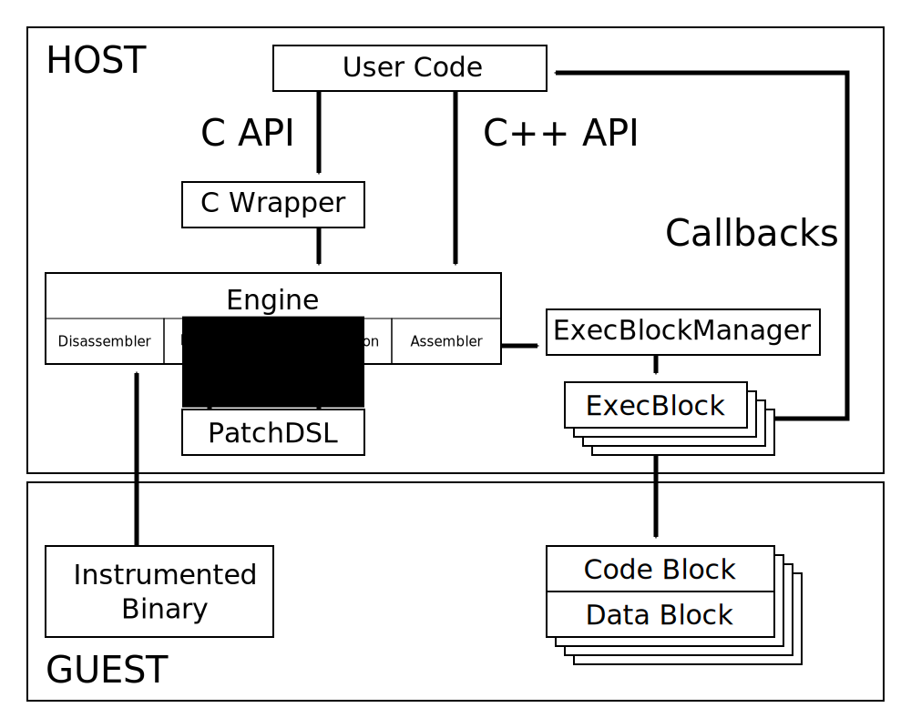
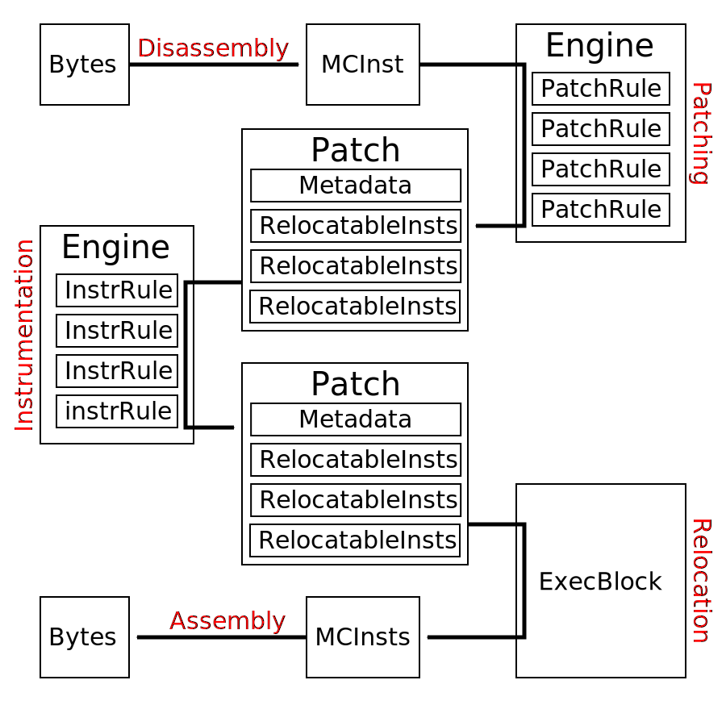

.. _instrumentation_process:

Instrumentation Process
=======================

Introduction
------------

The Engine reads and disassembles the instrumented binary basic block per basic block. In case a
conditional branch terminates a basic block, the execution result of this basic block is needed to 
determine the next basic block to execute. This makes the case for a per basic block 
processing and execution.

Every basic block is first patched to solve two main problems:

* Relocation:
    The basic block will be executed at a different location and thus every usage of the Program 
    Counter, either directly as an operand or indirectly when using relative memory addressing, 
    needs to be patched to make the code relocatable.
* Control Flow Control:
    Branching instructions should not be directly executed as this would result in the execution 
    escaping from the instrumentation process. Thus the resulting target of a branching instruction 
    needs to be computed without being taken.

Once a basic block has been patched, the instrumentations requested by the user code are applied. 
Both the patching and the instrumentation are expressed in an *Embedded Domain Specific Language*
[#dsl]_ called :doc:`/patchdsl` which is executed by the engine.

The resulting instrumented basic block is then handed over to the ExecBlockManager which handles 
a cache of basic blocks placed inside execution units called :doc:`/execblock`. The ExecBlockManager is 
tasked with finding memory space inside an ExecBlock to place the instrumented basic block and also
retrieving cached basic blocks.

An ExecBlock manages on the guest side two memory pages: one for the code, the code block, and one 
for the data, the data block. The ExecBlock also handles the resolution of the relocation of the 
patched code before assembling it in the code block.

The instrumentation of the code allows to make callbacks to the user code directly from the 
instrumented binary through the ExecBlock. These callbacks allow to inspect and modify the state 
of execution of the guest on the host side at every point in time.

.. [#dsl] https://en.wikipedia.org/wiki/Domain-specific_language 

Implementation
--------------

The figure below presents the *life of an instruction* and summarizes the main steps and classes 
involved along the way. This is intended to give an overview of what the internals do.

An instruction exists in three different representations inside QBDI:

Bytes
  Raw bytes of machine code in memory.
MCInst
  LLVM machine code representation. The instruction is only partially disassembled but still 
  provides a list of operands. One interested in more details regarding this representation should 
  refer to the official LLVM documentation and experiment with `llvm-mc -show-inst`.
RelocatableInst
  QBDI representation of a relocatable MCInst. It consists in an MCInst and relocation information.

There is another important class: :cpp:class:`QBDI::Patch`. A :cpp:class:`QBDI::Patch` aggregates 
the patch and the instrumentation of a single instruction in the form of a list of 
:cpp:class:`QBDI::RelocatableInst`. It is the smallest unit of code which can be assembled inside 
an :cpp:class:`QBDI::ExecBlock` as patching or instrumentation code cannot be split in parts 
without problematic side effects.

The assembly and disassembly steps are directly handled by LLVM for us. The Engine takes care of 
the patching and instrumentation using a programmable list of :cpp:class:`QBDI::PatchRule` and 
:cpp:class:`QBDI::InstrRule`. More details on those rules can be found in the :doc:`/patchdsl` 
chapter. Relocation is handled directly in the :cpp:class:`QBDI::ExecBlock`.

