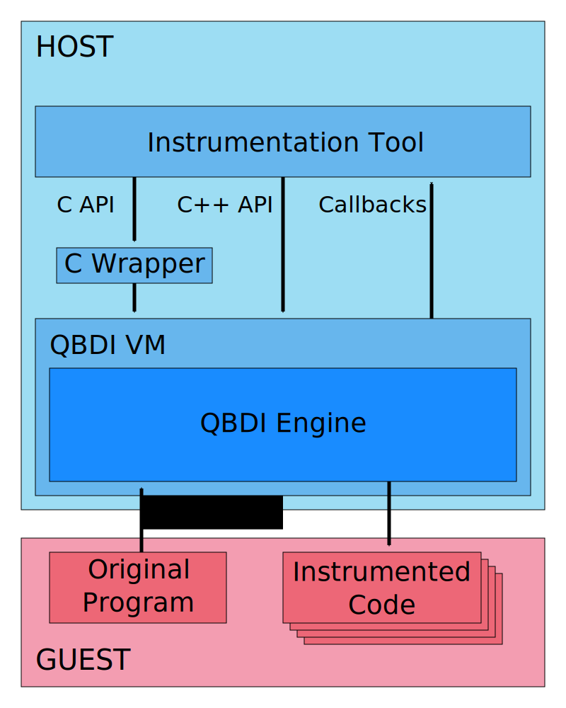

.. _user-introduction:

Introduction
============

.. role:: red

Why a DBI?
-----------

Debuggers are a popular approach to analyze the execution of a binary. While those tools are 
convenient, they are also quite slow. This performance problem is imperceptible to human users but 
really takes its toll on automated tools trying to single step through a complete program. Such 
automated tools are useful for tracking the evolution of the program states, extracting execution 
statistics and verifying that some runtime conditions hold true. Examples of usage include memory 
corruption debuggers, profilers, timeless debuggers and side-channel attack tools.

This performance cost is due to the kernel playing the role of a middleman between the debugger and 
the debuggee. The only way to get rid of the problem is to place the tool inside the binary being 
analyzed and this is what Dynamic Binary Instrumentation does: injecting instrumentation code 
inside the binary at runtime.

Why QBDI?
----------

Existing DBI framework were designed more than 15 years ago, focusing on features and 
platforms that made sense at the time. Mobile platform support is often unstable or inexistent 
and instrumentation features are either simplistic or buried in low-level details.

QBDI attempts to retain the interesting features of those frameworks while avoiding their pitfalls 
and bringing new designs and ideas. Its goal is to be a cross-platform and multi-architectures 
modular DBI framework. The modular design exposes the DBI engine as a library that can start an 
instrumented execution anywhere, anytime and easily be incorporated in other tools.

QBDI : How does it work?
-------------------------

The core of DBI frameworks relies on the Just-In-Time (JIT) recompilation of the original program. 
This allows to interleave additional assembly code which can instrument any part of the execution. 
The DBI engine performing the JIT recompilation and the JITed code itself run in the same process 
but need to each have their own processor context. This requires to perform context switches between 
the two like a virtual machine would. We thus call the DBI context the **host** and the original 
program context the **guest**.

The **host** is composed of QBDI components and the **instrumentation tool**. The **instrumentation 
tool** is the code written by the user which interacts with the **QBDI VM** through a **C API** or 
a **C++ API**. The **instrumentation tool** can register **callbacks** to occur on specific events 
triggered either by QBDI or by the instrumentation code inserted inside the original program. The 
user documentation further details these APIs and how callbacks work.

Inside the VM resides the **QBDI Engine** which manages the instrumented execution. The engine runs 
the JIT loop which reads the **original program** code and generates the **instrumented code** which 
is then executed. Each loop iteration operates on a basic block, a sequence of instructions which 
ends with a branching instruction. This basic block is first patched, to accommodate the JIT 
process, and then instrumented as instructed by the instrumentation tool. This instrumented basic 
block is written in executable memory, executed and returns the address of the next basic block to 
execute. To avoid doing twice the same work, this **instrumented code** is actually written in a 
code cache.
